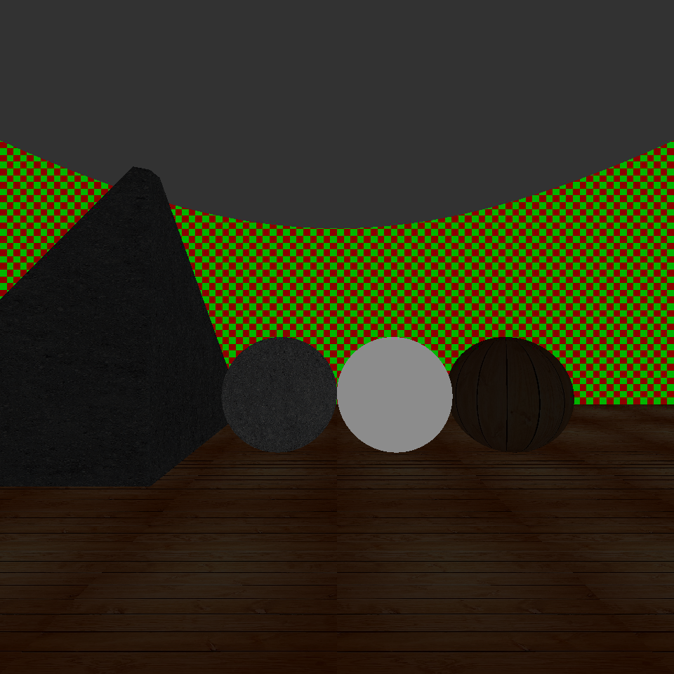
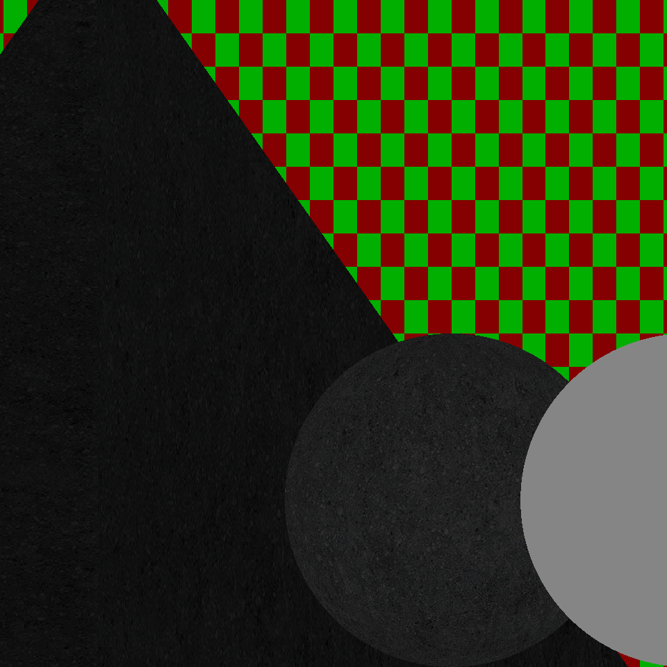
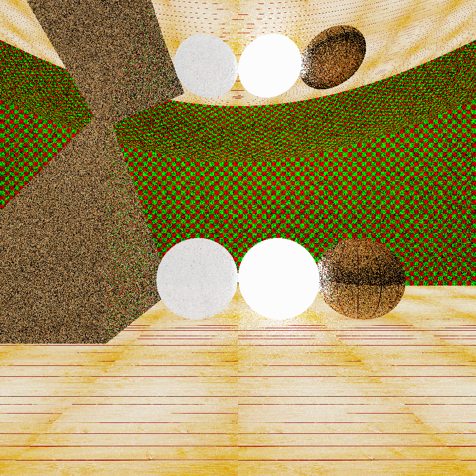
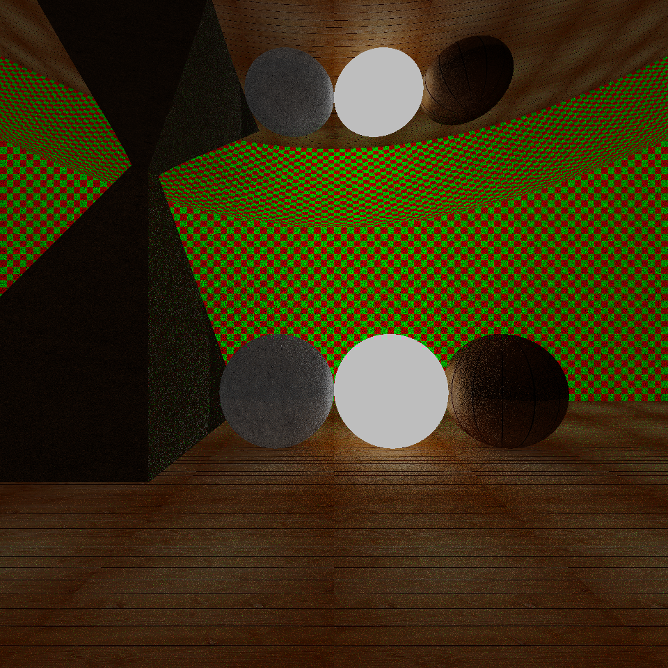
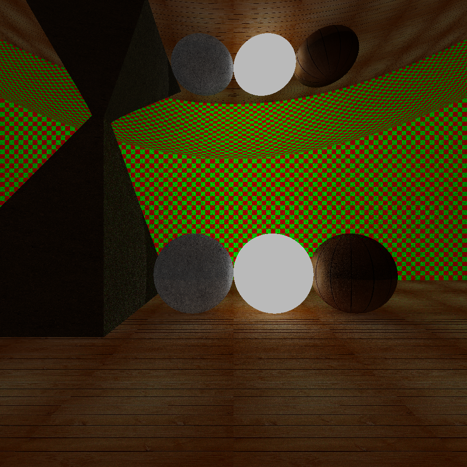

# LITracer
This is a very simple [Ray-Tracer](https://developer.nvidia.com/discover/ray-tracing#:~:text=Ray%20tracing%20is%20a%20rendering,%2C%20shadows%2C%20and%20indirect%20lighting.) written in [Kotlin](https://en.wikipedia.org/wiki/Kotlin_(programming_language)) language 

## Installation

## Usage
The program was made using Gradle and can perform three tasks:

 - ### Demo  
     
   Create a pfm file of a demo scene and (optionally) a PNG image allowing the user to choose between a perspective or an orthogonal point of view
   (in fondo aggiungere due foto linkate) 

   The available rendering algorithms are the following:
   - onoff:         the objects of the scene are displayed in white color with a black background.
   
     Here some [examples](#on-off-renderer-examples) using onoff rendering algorithm.
     
   - flat:          the objects of the scene are displayed with their real colors without simulating the realistic behaviour of light

     Here some [examples](#flat-renderer-examples) using flat rendering algorithm.
   - path tracing:  the objects are displayed with their real colors and physical properties simulating the realistic behaviour of light

     Here some [examples](#pathtracing-renderer-examples) using pathtracing rendering algorithm.

   The demo command also allows the user to move inside the scene specifying the translation and rotation movements.

   #### Demo usage:
   Basic usage of demo command
   
       `./gradlew run --args="demo --camera=<camera_type> --algorithm=<render_alg> -pfm <output_pfm_file_path>  -png <output_png_file_path>"`

   For further details execute `./gradlew run --args="demo"` and get the complete usage documentation.
   

   
 - ### pfm2png
      Execute conversion from a PFM file to a PNG image with the specified values of screen's gamma and clamp factor

   #### pfm2png usage:
   Usage of pfm2png
   
       `./gradlew run --args="pfm2png <input_PFM_file>.pfm <clamp value (float)> <gamma value of the screen (float)> <output_png_file>.png"`
   

   For further details execute `./gradlew run --args="pfm2png"` and get the complete usage documentation.

 - ### png2pfm
    Execute conversion from a PNG image to a PFM file with the specified values of screen's gamma and clamp factor

    #### png2pfm usage:

       `./gradlew run --args="png2pfm <output_PFM_file>.pfm <clamp value (float)> <gamma value of the screen (float)> <input_png_file>.png"`
   

   For further details execute `./gradlew run --args="png2pfm"` and get the complete usage documentation.

### Examples

#### On-Off renderer examples

Here is an example made with 11 spheres showing the behavior of on-off renderer using the two different choices of camera

This image is not obtainable from the flag `--algorithm=onoff`, this is only an example of the renderer behavior

  
  &nbsp;&nbsp;&nbsp;&nbsp;&nbsp;&nbsp;&nbsp;&nbsp;&nbsp;&nbsp;&nbsp;&nbsp;
  

<em>
 The image on the left  was generated using perspective camera, the image on the right was generated using orthogonal camera

</em>

 

#### Flat renderer examples
Here some examples obtained using `./gradlew run --args="demo -alg flat"`

&nbsp;&nbsp;&nbsp;&nbsp;&nbsp;&nbsp;&nbsp;&nbsp;&nbsp;&nbsp;&nbsp;&nbsp;

<em>
Demo image obtained using flat tracing algorithm, on the left image generated using perspective camera, on the right image generated using orthogonal camera with a rotation of 45 degree relative to the z-axis 

</em>

#### Pathtracing renderer examples
Here some examples obtained using `./gradlew run --args="demo -alg pathtracing"`.

The following examples of the demo image were generated using the path-tracing algorithm for different values of the parameter `--nray`.

Each one of those images is obtained with a value of max depth fixed at 3.

&nbsp;&nbsp;&nbsp;&nbsp;&nbsp;&nbsp;&nbsp;&nbsp;&nbsp;&nbsp;&nbsp;&nbsp;

<em>
On the left demo image obtained with nray=1, on the right demo image obtained with nray=5.
</em>

&nbsp;&nbsp;&nbsp;&nbsp;&nbsp;&nbsp;&nbsp;&nbsp;&nbsp;&nbsp;&nbsp;&nbsp;

<em>
On the left demo image obtained with nray=15, on the right demo image obtained with nray=20.
</em>

## History

See the file [CHANGELOG.md](https://github.com/TommiDL/LITracer/blob/master/CHANGELOG.md)

## License
The code is released under the Apache License version 2.0. See the file [LICENSE.md](https://github.com/TommiDL/LITracer/blob/master/LICENSE)

## Authors: 
[Tommaso Di Luciano](https://github.com/TommiDL),
[Maria Laura Ilisco](https://github.com/marialaurailisco),
[Ludovico Morabito](https://github.com/Ludovico-Morabito).
